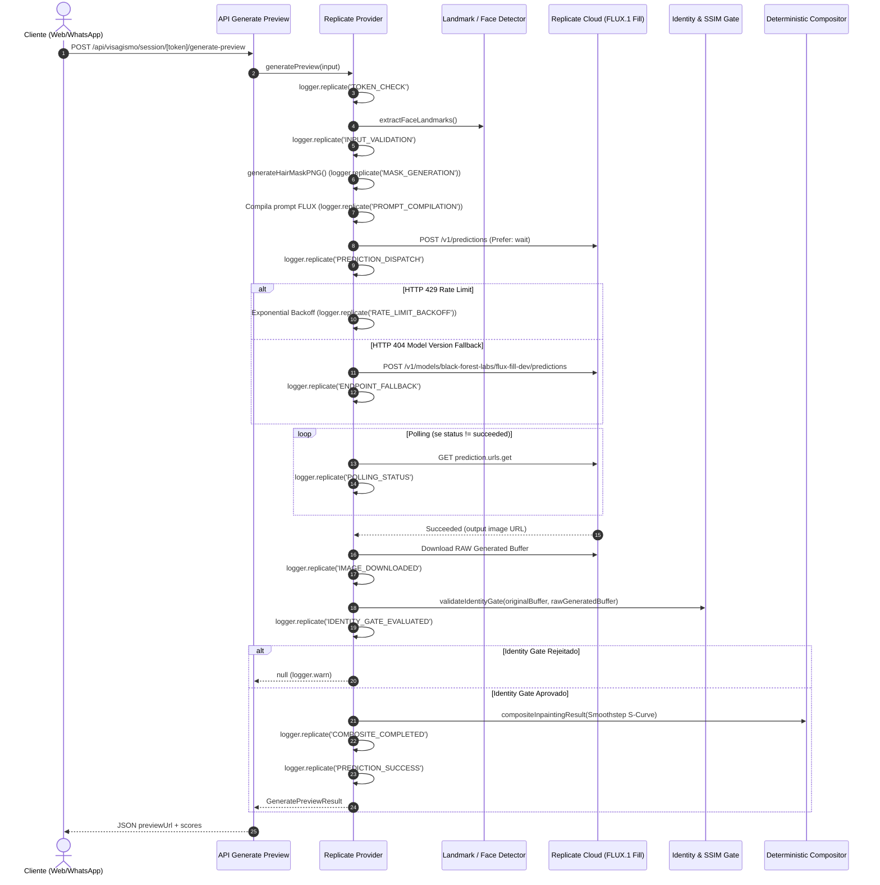

# Guia de Arquitetura de Logs e Lógica do Replicate AI (BarberFlow)

## 1. Visão Geral do Sistema de Logs

O BarberFlow possui um sistema centralizado de logs estruturados em JSON (`src/lib/logger.ts`) com sanitização recursiva de dados sensíveis e métodos de domínio dedicados.

### Principais Recursos
- **Sanitização Automática:** Mascara senhas, hashes, chaves de API (`REPLICATE_API_TOKEN`, `GEMINI_API_KEY`, tokens JWT, etc.).
- **Truncamento de Buffers/Base64:** Evita poluição de terminal e saturação de logs truncando buffers binários e imagens em base64.
- **Correlation ID:** Geração de `requestId` para rastreamento de ponta a ponta.
- **Categorização por Módulo:** Logs tagueados (`REPLICATE_INPAINTING`, `VISAGISM_ENGINE`, `HTTP_API`, `AUTH`, `WHATSAPP_ENGINE`, `EVENT_BUS`).

---

## 2. Ciclo de Vida e Lógica do Replicate (FLUX.1 Fill Dev Inpainting)

O provedor oficial de geração de visual (`ReplicateInpaintingVisagismProvider` em `src/lib/visagism/providers/replicate.ts`) executa o pipeline em 12 etapas estruturadas com telemetria completa via `logger.replicate(...)`:



---

## 3. Catálogo de Eventos do Replicate AI

| Etapa (`step`) | Descrição | Metadados Principais |
| :--- | :--- | :--- |
| `TOKEN_CHECK` | Validação de presença do token do Replicate | `tokenFound`, `tokenSource`, `tokenMasked` |
| `INPUT_VALIDATION` | Validação do buffer da foto e resolução | `inputBytes`, `mimeType`, `imageDimensions`, `faceBox`, `confidence` |
| `MASK_GENERATION` | Geração da máscara PNG do cabelo/barba | `maskMode`, `maskBytes`, `maskDurationMs` |
| `PROMPT_COMPILATION` | Refinamento do prompt para FLUX Fill | `rawPrompt`, `compiledPrompt`, `promptHash`, `negativePrompt` |
| `PREDICTION_DISPATCH` | Envio da requisição de inferência ao Replicate | `model`, `modelVersion`, `guidance`, `steps`, `outputFormat`, `outputQuality` |
| `RATE_LIMIT_BACKOFF` | Tentativa de retry com backoff após HTTP 429 | `httpStatus: 429`, `attempt`, `retryDelayMs`, `endpoint` |
| `ENDPOINT_FALLBACK` | Redirecionamento para rota canônica de modelo | `httpStatus: 404`, `fallbackEndpoint`, `model` |
| `POLLING_STATUS` | Acompanhamento do progresso da inferência | `predictionId`, `status`, `attempt`, `pollLatencyMs`, `elapsedMs` |
| `IMAGE_DOWNLOADED` | Download do buffer da imagem RAW gerada | `predictionId`, `outputUrl`, `downloadBytes`, `imgDlLatencyMs` |
| `IDENTITY_GATE_EVALUATED`| Teste de fidelidade biométrica da face gerada | `predictionId`, `passed`, `identityScore`, `boxShiftRatio`, `featureDistance` |
| `COMPOSITE_COMPLETED` | Composição bit-a-bit e cálculo de SSIM | `predictionId`, `outsideDiffRatio`, `faceSSIM`, `compLatencyMs` |
| `PREDICTION_SUCCESS` | Sucesso completo da geração | `predictionId`, `provider`, `model`, `latencyMs`, `identityScore`, `faceSSIM` |
| `PREDICTION_ERROR` | Captura de exceção em qualquer etapa | `error`, `httpStatus`, `latencyMs` |

---

## 4. Exemplos de Uso do Logger

### Emissão Padrão
```typescript
import { logger } from '@/lib/logger';

// Log de informação
logger.info('Processamento concluído com sucesso', {
  module: 'BILLING',
  tenantId: 'tenant_123',
  durationMs: 120,
});

// Log de erro com captura automática de Stack Trace
try {
  // ...
} catch (err) {
  logger.error('Falha ao processar pagamento', err, {
    module: 'FINANCIAL',
    tenantId: 'tenant_123',
  });
}
```

### Emissão Replicate AI
```typescript
logger.replicate('PREDICTION_SUCCESS', {
  predictionId: 'pred_abc123',
  provider: 'REPLICATE_FLUX_FILL',
  model: 'black-forest-labs/flux-fill-dev',
  latencyMs: 1420,
  identityScore: 0.98,
  faceSSIM: 0.99,
  outsideDiffRatio: 0.0,
});
```
