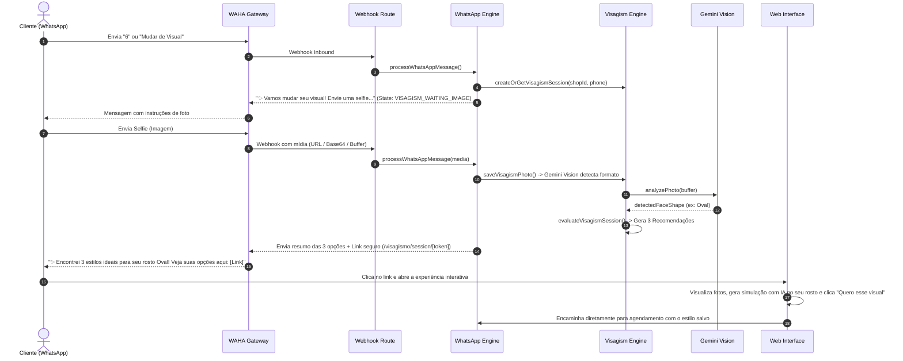

# 💈 BARBERFLOW — FASE 18: AUDITORIA DE ARQUITETURA
## Visagismo no WhatsApp ("Mude de Visual") — Integração com WAHA + n8n + Gemini Vision + Replicate

---

## 1. Visão Geral da Arquitetura Encontrada

A auditoria do código-fonte do **BarberFlow** revelou uma base modular, robusta e pronta para evolução incremental, sem necessidade de refatorações destrutivas ou criação de sistemas paralelos:

### 1.1 Módulo de Visagismo Existente
- **Localização**: `src/lib/visagism/`
  - `engine.ts`: Gerencia criação de sessões seguras com tokens aleatórios (`crypto.randomBytes(24)`), upload/exclusão de fotos (LGPD), avaliação determinística e persistência no banco.
  - `provider.ts`: Factory de provedores com fallback gracioso.
  - `providers/gemini.ts`: Provedor Google Gemini Vision (`gemini-3.6-flash`) para detecção de formato de rosto (`Oval`, `Quadrado`, `Redondo`, `Triangular`, `Retangular`, `Coracao`), proporções e análise visual da selfie.
  - `providers/replicate.ts`: Provedor Replicate Face Swap / Inpainting (`lucataco/faceswap`) com backoff exponencial contra limites de taxa (429) e suporte síncrono (`Prefer: wait`).
  - `catalog.ts`: Catálogo estruturado com 18 cortes masculinos, 8 barbas e 8 tonalidades capilares com URLs de retratos em alta definição.
  - `types.ts`: Tipos e contratos TypeScript tipados para perfis, recomendações e métricas de funil.
- **Páginas & APIs Web**:
  - `src/app/visagismo/session/[token]/page.tsx`: Interface visual interativa com passo a passo, showcase lado a lado ("Sua Foto" vs "Seu Rosto com Novo Corte"), gerador facial via IA e modal Lightbox em tela cheia.
  - `src/app/api/visagismo/session/route.ts`: Criação de sessões públicas.
  - `src/app/api/visagismo/session/[token]/route.ts`: Leitura dos dados da sessão.
  - `src/app/api/visagismo/session/[token]/photo/route.ts`: Upload e download seguro de fotos com validação LGPD.
  - `src/app/api/visagismo/session/[token]/evaluate/route.ts`: Avaliação do perfil e geração das 3 melhores recomendações.
  - `src/app/api/visagismo/session/[token]/generate-preview/route.ts`: Endpoint síncrono para geração facial via Replicate.
  - `src/app/api/visagismo/session/[token]/select/route.ts`: Registro da escolha do cliente e redirecionamento para agendamento ou compartilhamento WhatsApp.

### 1.2 Módulo de WhatsApp Conversacional
- **Localização**: `src/lib/whatsapp/`
  - `engine.ts`: Máquina de estados conversacional para WhatsApp (`IDLE`, `SELECTING_SERVICE`, `SELECTING_BARBER`, `SELECTING_DATE`, `SELECTING_PERIOD`, `SELECTING_TIME`, `CONFIRMING_BOOKING`, `CANCELLING`, etc.).
  - `provider.ts`: Suporte multi-provedor (WAHA, Meta Cloud API, n8n, Simulador).
  - `waha.ts`: Cliente HTTP para a instância WAHA (`https://evo.projetosunion.cloud`) para envio de texto e mídia.
  - `reminders.ts`: Cron e agendamento de lembretes automáticos pré-atendimento.
  - `src/app/api/webhooks/whatsapp/route.ts`: Endpoint receptor de webhooks com suporte a deduplicação de mensagens, formato Meta Cloud e formato direto (n8n / WAHA).

### 1.3 Banco de Dados (Prisma ORM)
- `VisagismSession`: Sessão vinculada a `barbershopId`, com `customerId` opcional, `publicToken` criptográfico, expiração (`expiresAt` = 24h) e chave de armazenamento da foto.
- `VisagismProfile`: Perfil de preferências e formato facial detectado.
- `VisagismRecommendation`: Recomendações calculadas (Top 3), score de match, dicas do barbeiro e flag `isSelected`.
- `VisagismMetric`: Eventos de telemetria isolados por barbearia (`visagism_started`, `photo_uploaded`, `style_selected`, `appointment_created`, etc.).
- `WhatsappSession`: Sessão conversacional de 30 minutos vinculada a `barbershopId` e telefone do cliente.
- `Customer`: Cadastro de clientes associado à barbearia, com preferências, histórico e consentimento de marketing/privacidade LGPD.

---

## 2. Componentes Reutilizáveis (Zero Duplicação)

| Necessidade da Fase 18 | Componente Existente Reutilizado |
| :--- | :--- |
| Análise de Selfie com Visão Computacional | `src/lib/visagism/providers/gemini.ts` (`gemini-3.6-flash`) |
| Geração Facial com Face Swap / Inpainting | `src/lib/visagism/providers/replicate.ts` (`lucataco/faceswap`) |
| Catálogo de Cortes, Barbas e Estilos | `src/lib/visagism/catalog.ts` |
| Persistência e Regras de Visagismo | `src/lib/visagism/engine.ts` |
| Experiência Web com Lightbox e Geração Facial | `src/app/visagismo/session/[token]/page.tsx` |
| Máquina de Estados e Normalização de Mensagens | `src/lib/whatsapp/engine.ts` |
| Conexão WhatsApp / Webhooks | `src/lib/whatsapp/waha.ts` e `src/app/api/webhooks/whatsapp/route.ts` |
| Agendamento de Horários e Anti-Conflito | `src/app/api/public/[slug]/book/route.ts` e `src/lib/whatsapp/engine.ts` |

---

## 3. Fluxo de Integração WhatsApp Proposto

---

## 4. Riscos Identificados e Medidas de Mitigação

1. **Risco de Timeout em Mensagens de Mídia**: O download e análise de fotos via WhatsApp não podem travar o webhook HTTP.
   - *Mitigação*: Processamento assíncrono seguro ou resposta imediata com processamento otimizado; link web interativo como porta de entrada de alta fidelidade.
2. **Risco de Vazamento LGPD / Privacidade**: Selfies de clientes são dados sensíveis.
   - *Mitigação*: Armazenamento temporário privado com TTL de 24h, endpoint de exclusão imediata (Direito ao Esquecimento), e proibição absoluta de logs de base64 ou URLs privadas.
3. **Risco de Custo Excessivo com IA**: Abuso de chamadas ao Replicate.
   - *Mitigação*: Limite estrito de 3 gerações por sessão (`VISAGISM_MAX_GENERATIONS_PER_SESSION=3`) e cache inteligente por recomendação.
4. **Risco de Regressão em Módulos Críticos**: Alterações no WhatsApp não podem afetar agendamentos, cancelamentos ou consultas existentes.
   - *Mitigação*: Estado `VISAGISM_WAITING_IMAGE` isolado na máquina de estados, fallback automático para IDLE ao digitar 0 ou MENU, e suíte completa de testes automatizados.
