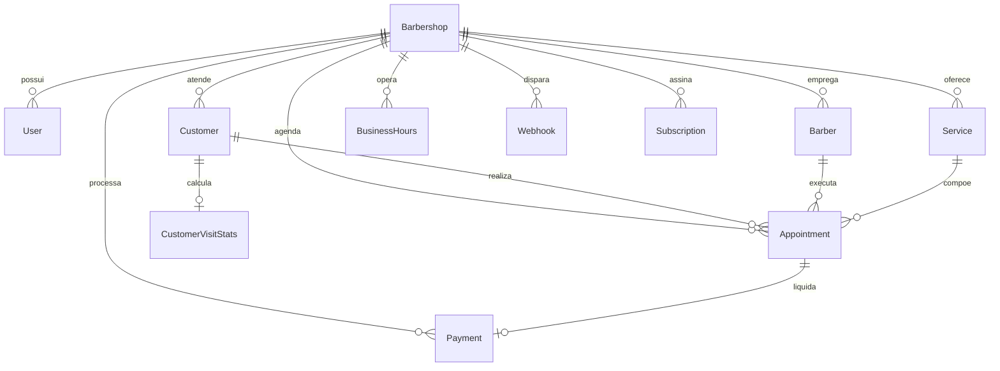

# Modelagem de Banco de Dados — BarberFlow

O banco de dados do **BarberFlow** utiliza o **Prisma ORM** e foi modelado com suporte a PostgreSQL (produção) e SQLite (desenvolvimento local).

---

## 1. Diagrama Entidade-Relacionamento

---

## 2. Entidades Principais

### `Barbershop` (Tenant)
- `id`: UUID único do tenant.
- `name`: Nome da barbearia.
- `slug`: Identificador público único para agendamentos (`/b/[slug]`).
- `phone`, `address`, `city`, `state`, `logoUrl`.

### `User` (Administradores e Donos)
- `id`, `barbershopId`, `name`, `email`, `passwordHash`, `role` (`SUPERADMIN`, `OWNER`, `BARBER`, `RECEPTIONIST`).

### `Barber` (Profissionais da Barbearia)
- `id`, `barbershopId`, `name`, `phone`, `commission` (percentual de 0 a 100), `specialty`, `isActive`, `deletedAt`.

### `Service` (Catálogo de Serviços)
- `id`, `barbershopId`, `name`, `description`, `price` (Float), `durationMin` (Int), `isActive`, `deletedAt`.

### `Customer` & `CustomerVisitStats` (Clientes & Inteligência de Recorrência)
- `Customer`: `name`, `phone`, `email`, `status` (`NOVO`, `ATIVO`, `EM_RISCO`, `INATIVO`, `VIP`), `recurrenceRate` (`ALTA`, `MEDIA`, `BAIXA`), `deletedAt`.
- `CustomerVisitStats`: `totalVisits`, `totalSpent`, `avgTicket`, `avgDaysBetweenVisits`, `medianDaysBetween`, `lastVisitDate`, `estimatedNextVisit`, `daysSinceLastVisit`.

### `Appointment` (Agendamento)
- `id`, `publicToken` (Token público seguro para autoatendimento), `barbershopId`, `customerId`, `barberId`, `serviceId`.
- `scheduledAt`, `endAt`, `durationMinutes`, `price`.
- Snapshots imutáveis: `serviceNameSnapshot`, `servicePriceSnapshot`.
- `status`: `AGENDADO`, `CONFIRMADO`, `EM_ATENDIMENTO`, `CONCLUIDO`, `CANCELADO`, `NO_SHOW`.
- `cancelReason`, `startedAt`, `completedAt`, `cancelledAt`.

### `Payment` (Financeiro)
- `id`, `barbershopId`, `appointmentId`, `customerId`, `barberId`, `amount`, `method` (`PIX`, `DINHEIRO`, `CARTAO_CREDITO`, `CARTAO_DEBITO`, `OUTRO`), `status` (`PAGO`, `PENDENTE`, `CANCELADO`).

### `BusinessHours` (Horários de Funcionamento)
- `barbershopId`, `dayOfWeek` (0=Domingo, 1=Segunda ... 6=Sábado), `openTime` (HH:MM), `closeTime` (HH:MM), `isOpen`.

### `Webhook` (Integração n8n)
- `id`, `barbershopId`, `url`, `secret` (Chave HMAC), `events` (Array JSON), `isActive`, `lastTriggerAt`, `lastStatus`.
